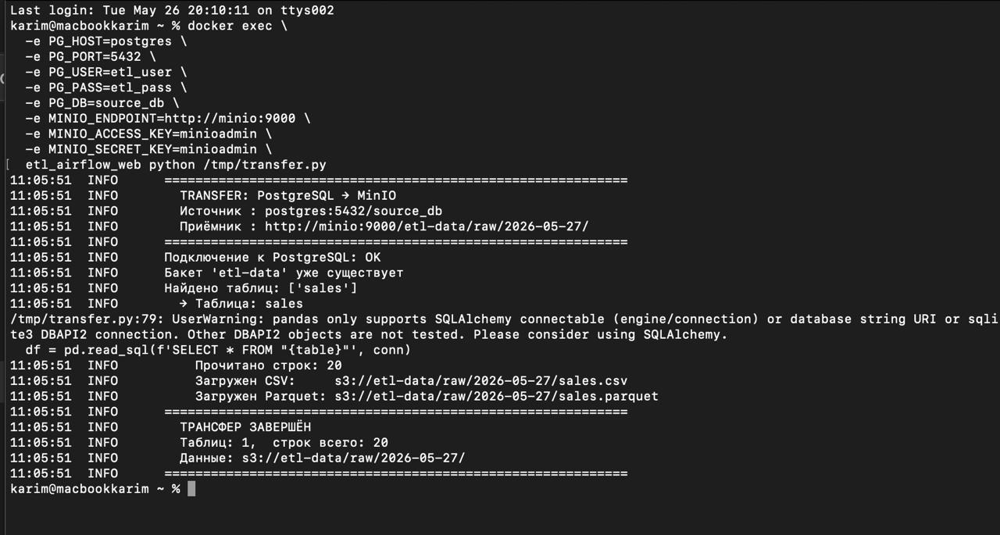
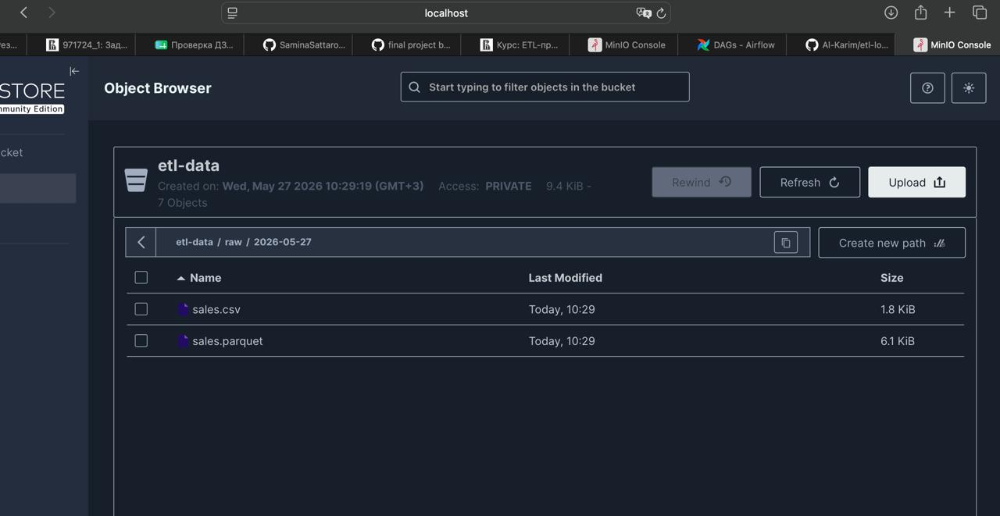
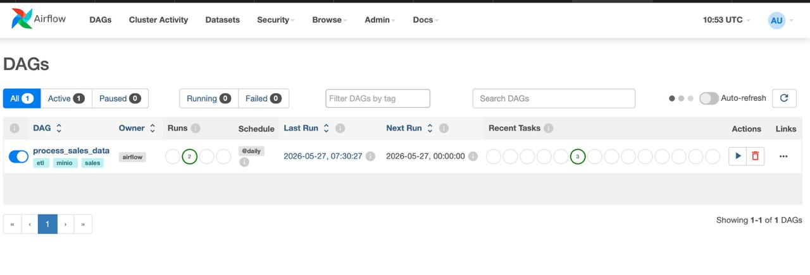
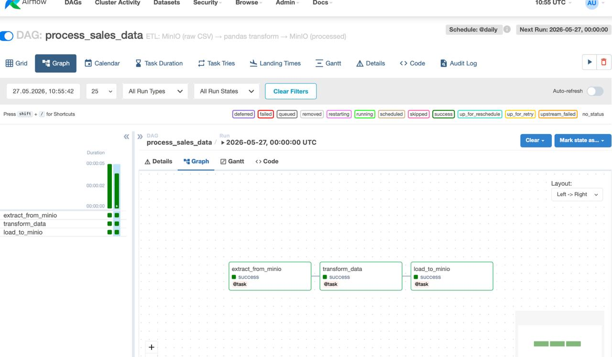
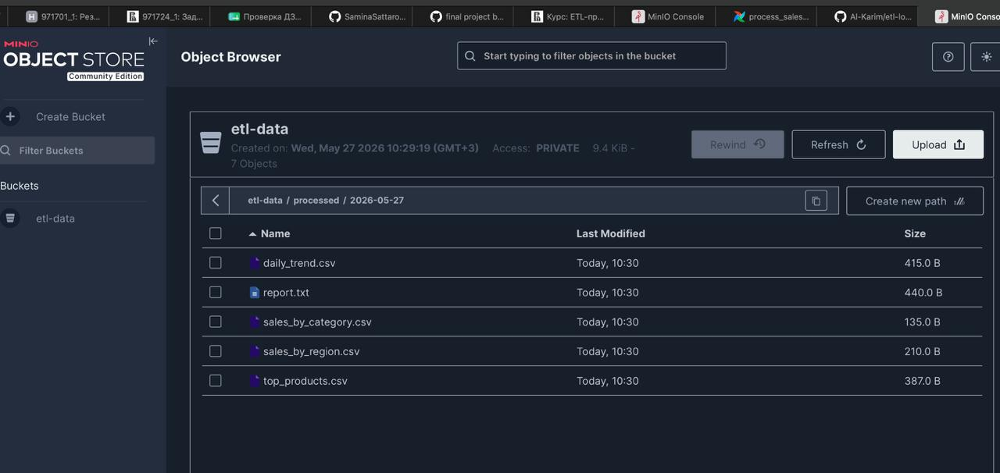

# ETL-процессы: Локальный стек (ДЗ 13–14)

Практическое задание по темам **«Хранение данных в облаке»** и **«Работа с облачными вычислениями»**, реализованное локально с помощью Docker.

## Соответствие облачным сервисам

| Yandex Cloud | Локальный аналог |
|---|---|
| Managed Service for PostgreSQL | PostgreSQL 15 (Docker) |
| Object Storage | MinIO (S3-совместимый) |
| Data Transfer | `scripts/transfer.py` |
| Managed Apache AirFlow | Apache Airflow 2.8.1 (Docker) |
| Data Processing | pandas (внутри Airflow DAG) |

---

## Структура проекта

```
etl/
├── docker-compose.yml          # Все сервисы
├── Makefile                    # Удобные команды
├── init/
│   └── 01_init.sql             # Тестовые данные (таблица sales, 20 строк)
├── scripts/
│   ├── transfer.py             # Перенос PostgreSQL → MinIO
│   └── requirements.txt
└── dags/
    └── process_data_dag.py     # Airflow DAG: extract → transform → load
```

---

## Быстрый старт

### 1. Запустить все сервисы

```bash
docker compose up -d
```

Первый запуск занимает ~3–5 минут (скачивание образов + инициализация Airflow).

### 2. Запустить трансфер (PostgreSQL → MinIO)

```bash
# Из контейнера Airflow (рекомендуется)
docker cp scripts/transfer.py etl_airflow_web:/tmp/transfer.py
docker exec \
  -e PG_HOST=postgres -e PG_PORT=5432 \
  -e PG_USER=etl_user -e PG_PASS=etl_pass -e PG_DB=source_db \
  -e MINIO_ENDPOINT=http://minio:9000 \
  -e MINIO_ACCESS_KEY=minioadmin -e MINIO_SECRET_KEY=minioadmin \
  etl_airflow_web python /tmp/transfer.py
```

### 3. Запустить DAG в Airflow

```bash
docker exec etl_airflow_web airflow dags unpause process_sales_data
docker exec etl_airflow_web airflow dags trigger process_sales_data
```

Или через веб-интерфейс: **http://localhost:8080** → DAG `process_sales_data` → кнопка ▶

---

## Адреса сервисов

| Сервис | URL | Логин / Пароль |
|---|---|---|
| MinIO Console | http://localhost:9011 | minioadmin / minioadmin |
| Airflow UI | http://localhost:8080 | admin / admin |
| PostgreSQL | localhost:5433 | etl_user / etl_pass / source_db |

---

## Часть 1 — Data Transfer (PostgreSQL → MinIO)

**Схема:** PostgreSQL → MinIO

Скрипт `transfer.py`:
1. Подключается к PostgreSQL (кластер-источник)
2. Читает все таблицы схемы `public`
3. Создаёт бакет `etl-data` в MinIO (эндпоинт-приёмник)
4. Загружает данные в форматах **CSV** и **Parquet**

### Результат трансфера — терминал



### Результат трансфера — MinIO (raw-файлы)



---

## Часть 2 — Обработка данных (Airflow + Data Processing)

**DAG:** `process_sales_data` (файл `dags/process_data_dag.py`)

```
extract_from_minio → transform_data → load_to_minio
```

| Задача | Что делает |
|---|---|
| `extract_from_minio` | Читает `sales.csv` из MinIO |
| `transform_data` | Агрегирует: по категории, региону, топ-товары, тренд по дням |
| `load_to_minio` | Сохраняет результаты CSV + отчёт `report.txt` |

### Список DAGов в Airflow



### Граф выполнения DAG



### Результат обработки — MinIO (processed-файлы)



---

## Управление

```bash
make start      # запустить сервисы
make stop       # остановить (данные сохраняются)
make clean      # остановить + удалить все данные
make status     # статус контейнеров
make logs       # логи Airflow
```

---

## Остановка

```bash
docker compose down        # остановить (данные сохранятся)
docker compose down -v     # остановить + удалить все данные
```
